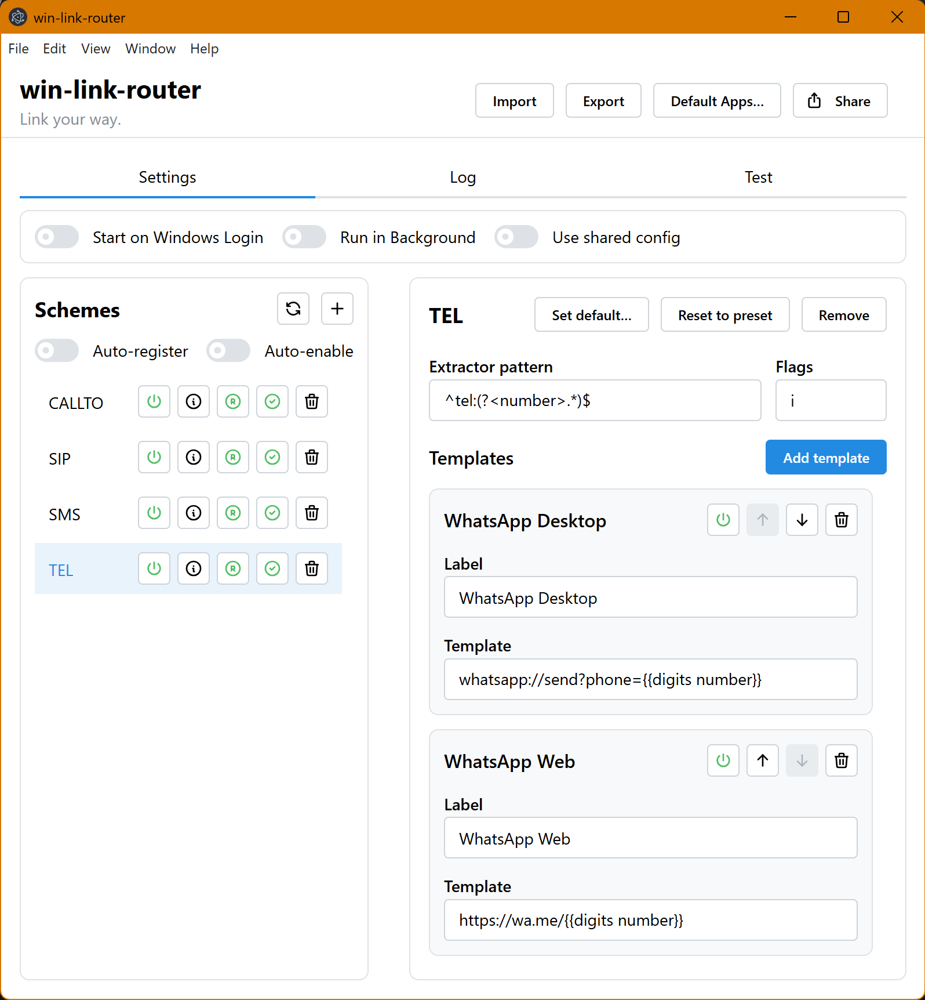
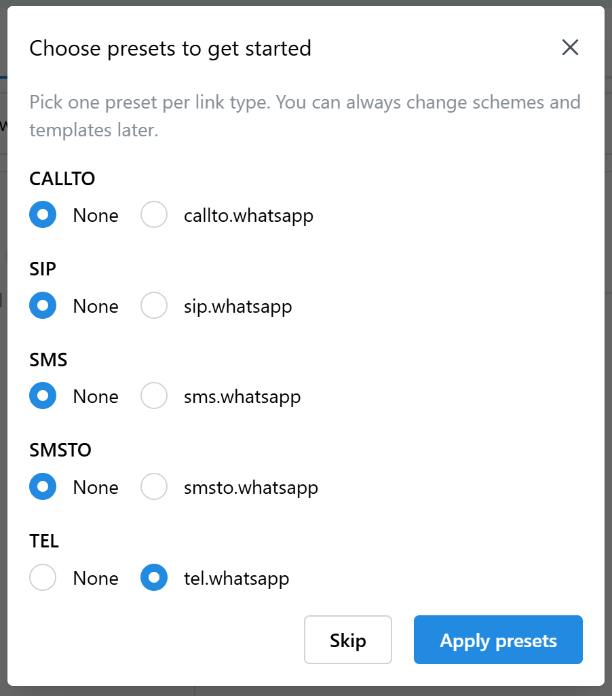
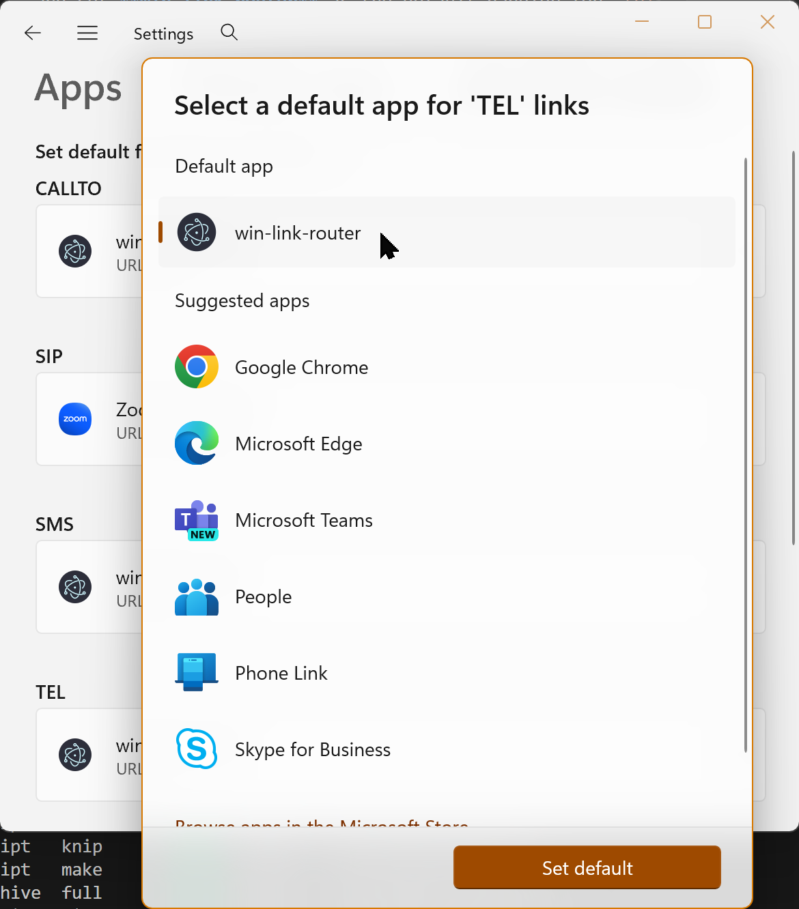
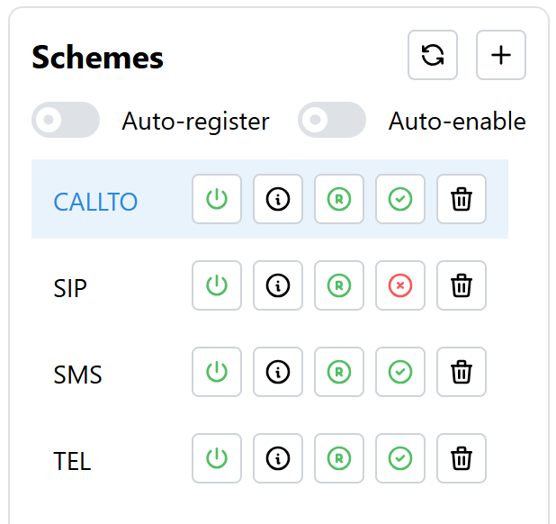
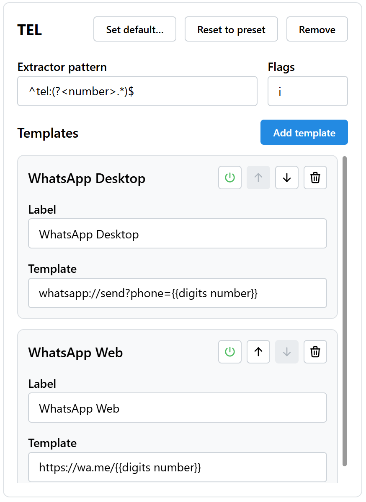
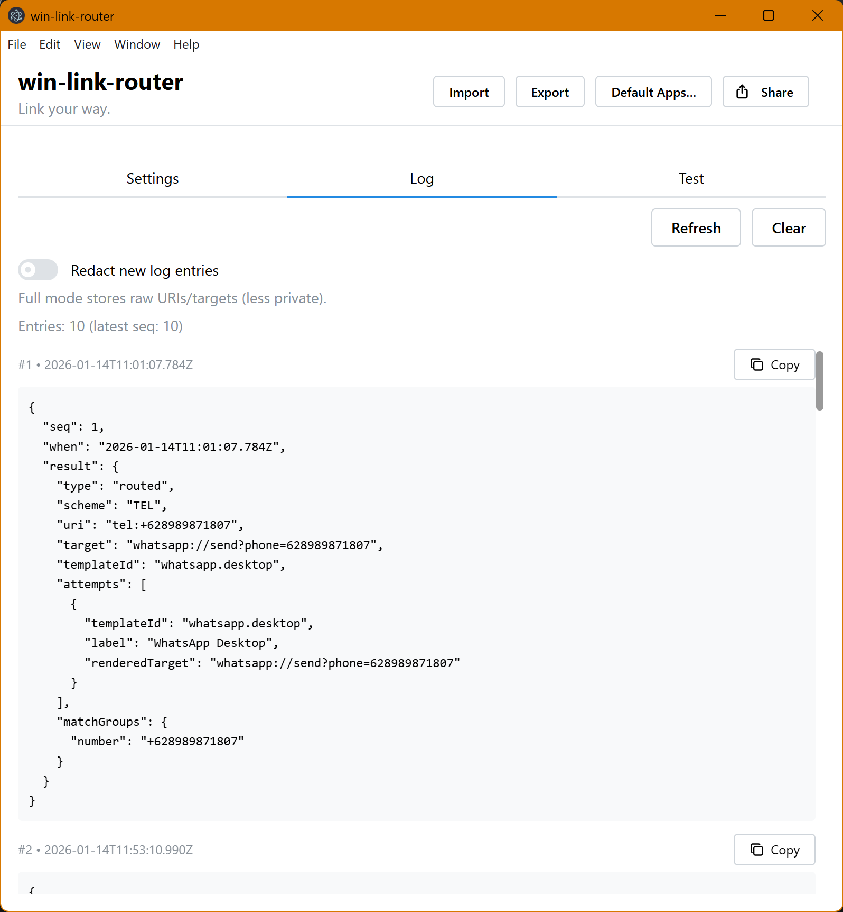
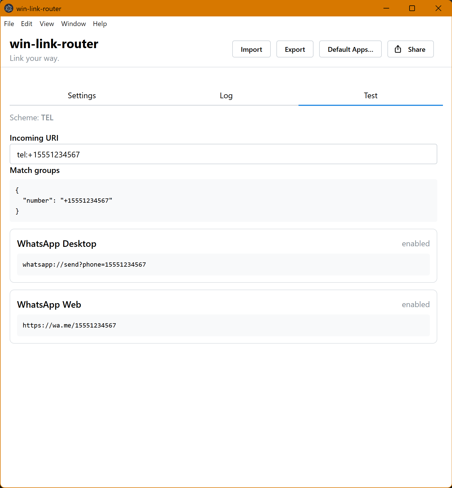
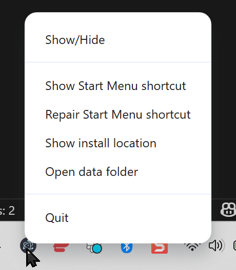
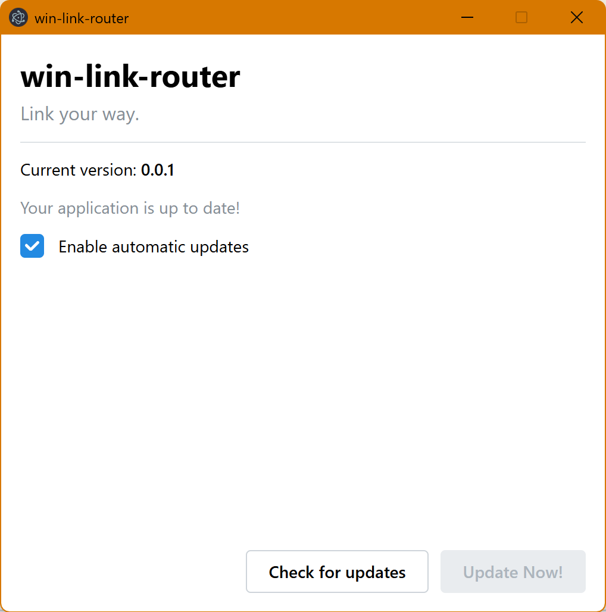

# win-link-router

**Link your way.**

A Windows desktop app that lets you route protocol links (like `tel:`) to the app or URL you actually want, using simple rules and ordered fallbacks.

Typical use case: clicking a `tel:` link in a browser should open WhatsApp (Desktop first, Web fallback), not the default dialer.

---

<p align="center"><a href="./assets/main-settings.png"><i>Main window – Settings tab (click to expand)</i></a></p>

---

## What it does

- **Routes protocol URIs** (for example `tel:+15551234567`) to target apps/URLs based on your configuration.
- **Supports ordered fallbacks**: try Template A, then Template B if opening fails.
- **Windows Default Apps friendly**:
  - The app can register itself as a _candidate handler_ (so Windows can show it as an option).
  - You still choose the **default handler** in Windows Settings (the app does not and cannot set defaults for you reliably).
- **Built-in presets** to get started fast (currently includes `TEL/SIP/CALLTO/SMS/SMSTO → WhatsApp`).
- **Debug tools built in**: a Test tab to see extractor matches and rendered targets; a Log tab for routing history.

## Why this tool?

I built this because I lived the pain: I had `TEL` links mapped to WhatsApp, and after a recent Windows update they all stopped working.

**win-link-router** exists to make routing explicit and resilient: it lets you map **ANY** link type (scheme/protocol) to **ANY** application or web service, using templates—whether that target is a native app protocol like `whatsapp://...` or a web URL like `https://...` (with ordered fallbacks).

---

## Install

### Recommended: download a release

1. Go to **GitHub Releases**: https://github.com/karmaniverous/win-link-router/releases
2. Download and install the latest Windows build.
3. Launch **win-link-router** from the Start Menu.

> Note: Windows protocol registration and Default Apps integration only work in packaged builds. Development runs are intentionally limited here.

---



## Quick start (TEL → WhatsApp)

1. Open **win-link-router**.
2. On first run, choose the **TEL WhatsApp** preset (or add `TEL` later).
3. In **Settings → Schemes**, ensure `TEL` is:
   - **Enabled** (power icon)
   - **Registered** (registration icon)
4. Click **Set default…** for `TEL` (or use **Default Apps…** in the header) and set **win-link-router** as the default handler for `tel:` links in Windows.
5. Paste a test link like `tel:+1 (555) 123-4567` into the **Test** tab to confirm the rendered targets look correct.
6. Click a `tel:` link anywhere (browser, email, chat) and the router will forward it.

---



## How routing works (mental model)

**win-link-router** is configured **per scheme** (also called a protocol).

For each scheme you configure:

1. **Extractor (regex)** is applied to the _entire incoming URI_.
2. If it matches, **named capture groups** become variables for templates.
3. **Templates** are evaluated in order:
   - Render a target string (Handlebars)
   - Try to open it via Windows
   - If opening fails, try the next enabled template (fallback)
4. If routing fails, the app opens the UI and shows diagnostics (and pre-fills the Test tab with the failing URI).

### Key concepts

- **Scheme**: the part before the first `:` in a URI. Examples: `TEL`, `MAILTO`, `CALLTO`.
- **Enabled vs Registered**
  - **Enabled**: router will process incoming links for this scheme.
  - **Registered**: the app should appear as a candidate handler in Windows for this scheme.
  - Rule: **Registered implies Enabled**.
- **Extractor**: a single regex per scheme (pattern + optional flags). Must use named capture groups.
- **Template**: a Handlebars string that produces a target URL/protocol (for example `whatsapp://...` or `https://...`).

## Using the app

### Settings tab

This is where you configure schemes and templates, and manage lifecycle settings.

---



- enabled toggle (power)
- registration toggle
- default status indicator (default / not default / unknown)
  Also show the info tooltip content once (expected/actual ProgId), but redact any sensitive paths if present.

#### Add a scheme

- Click **Add scheme**
- Enter a scheme name (for example `TEL` or `mailto`)
- If presets exist for that scheme, you can initialize from a preset

#### Edit extractor

- Use the **Extractor pattern** field (regex)
- Use **Flags** for regex flags (global `g` is not allowed)

Example extractor for TEL:

```regex
^tel:(?<number>.*)$
```

Flags:

```text
i
```

#### Edit templates

Templates are tried top-to-bottom (enabled templates only). You can:

- Add/remove templates
- Enable/disable templates
- Reorder templates (fallback order)
- Reset the scheme to a preset (if it was created from one)

---



- Extractor pattern + Flags
- At least two templates (WhatsApp Desktop + WhatsApp Web)
- Reorder controls and enable/disable (power) icons
  Use a non-personal sample URI in any visible fields.

### Template helpers you can use

Templates are Handlebars with strict variable resolution (missing values cause a render error). The app provides a few generic helpers:

- `{{trim value}}` - Removes leading and trailing whitespace.
- `{{lower value}}` - Converts the value to lowercase.
- `{{upper value}}` - Converts the value to uppercase.
- `{{urlEncode value}}` - URL-encodes the value (percent-encoding) for safe use in query strings.

Example template:

```handlebars
whatsapp://send?phone={{digits number}}
```

Advanced note: the template context includes:

- top-level variables for each named capture group
- `uri` (the full incoming URI)
- `match` (regex match info, including `match.groups.*`)

### Log tab (routing history)

The Log tab is for debugging. You can:

- Refresh entries
- Clear the log
- Toggle **Redacted** vs **Full** logging for new entries

Redacted mode is recommended: it avoids storing raw URIs and full targets (which may contain sensitive payloads).

---



### Test tab (dry-run evaluation)

Paste a URI and the app will:

- Infer the scheme from the URI
- Run the extractor
- Show match groups
- Show each template’s rendered output (or render error)

This is the fastest way to debug regex and template issues before relying on Windows routing.

---



## Windows integration notes

### Candidate registration vs default handler

- **Candidate registration** makes **win-link-router** appear as an option in Windows Default Apps for a scheme.
- **Default handler** is what Windows actually uses when a link is clicked.
- Windows protects default handlers; this app will not attempt to force defaults.

If some enabled + registered schemes are not set as default in Windows, the app will show a non-blocking warning.

### Tray / background behavior (optional)

- **Run in Background**: keeps the app in the tray so routing can happen without opening the UI.
- **Start on Windows Login**: start in the tray at login (implies Run in Background).

---



## Import / export and shared config

### Import / export (portable)

- **Export** saves your schemes and templates to a JSON file.
- **Import** replaces your schemes/templates from a JSON file.
- Per-user settings (like run-at-login and shared config path) are preserved locally.

### Shared config mode

If you enable **Use shared config**, schemes/templates are read from a shared JSON file path. This is useful for sharing rules across accounts or machines.

If the shared file is missing, unreadable, or not writable:

- scheme/template editing becomes **read-only**
- settings remain editable so you can fix or disable shared mode

## Updates

**win-link-router** supports automatic updates on Windows (packaged builds) using `update.electronjs.org`.

Open **Help → About** to:

- see the current version
- check for updates
- update immediately
- toggle automatic updates

---

<!-- Screenshot: About window -->



## Troubleshooting

### Nothing happens when clicking a link

- Make sure win-link-router is set as the **default** handler for that scheme in Windows Default Apps.
- Confirm the scheme is **Enabled** in the app.
- Confirm at least one template is **Enabled**.

### Routing failed: extractor did not match

- Go to the **Test** tab.
- Paste the exact URI you clicked.
- Fix the extractor pattern/flags until match groups appear.

### Routing failed: template render error

- Your template referenced a missing value (for example `{{digits number}}` when the extractor does not define `(?<number>...)`).
- Use the Test tab to see which variables exist in match groups.

### Routing failed: could not open any target

- The rendered target protocol may not be installed/registered on your machine (for example `whatsapp://`).
- Add an `https://...` fallback template as the next option.

## Privacy

- Configuration and logs are stored per-user in the app’s data folder.
- Routing logs default to **redacted** mode (recommended).
- If you enable full logging, logs may include sensitive payloads and targets.

## Support

- Issues: https://github.com/karmaniverous/win-link-router/issues
- Discussions / help: https://github.com/karmaniverous/win-link-router/discussions

## License

BSD-3-Clause. See `LICENSE` in this repository.
